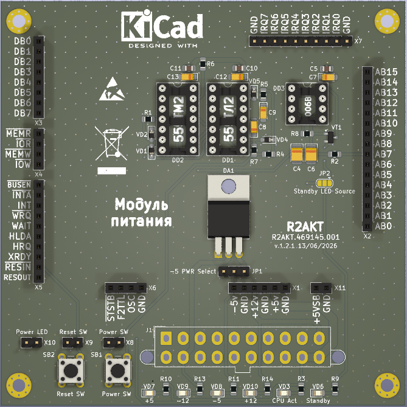

License addendum - https://github.com/R2AKT/power_unit/blob/main/Addendum.txt
# power_unit

Power control unit. For Mega-80 (Mega-580) DIY 8-bit micro-computer - https://github.com/R2AKT/Mega-80.
ATX PSU control based on 'ISA 8-bit Backplane' (https://github.com/skiselev/isa8_backplane).

Status - Tested.

Плата питания. Для подключения к процессорной плате CPU_8080 - https://github.com/R2AKT/CPU_8080.
Управление блоком питания ATX на основе 'ISA 8-bit Backplane' (https://github.com/skiselev/isa8_backplane).

Статус - Проверено.
